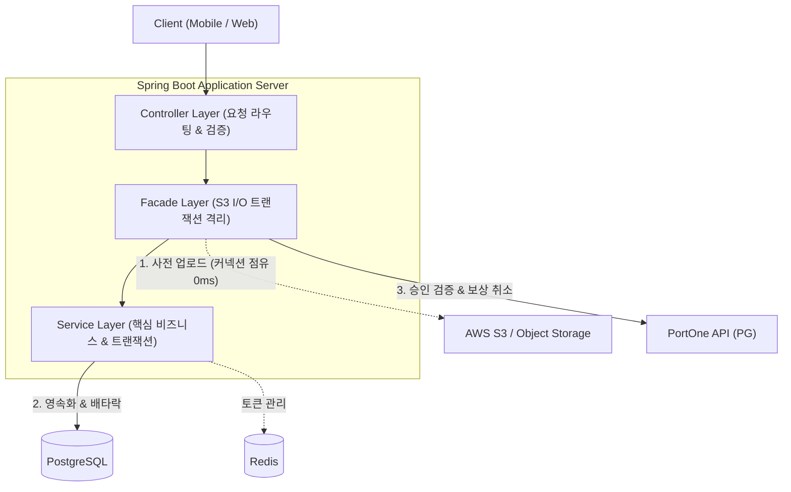
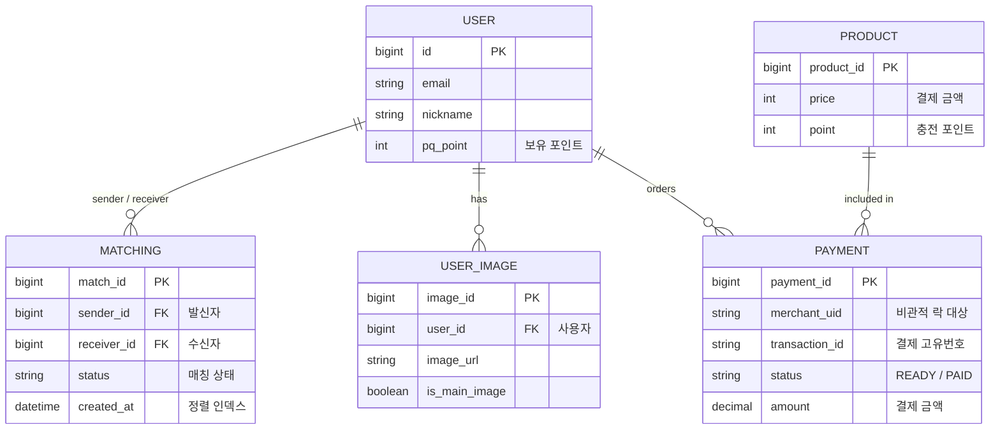

# 💘 PIQ  - Backend API Server

<div align="center">


<br/>

**사용자 맞춤 프로필 추천과 포인트 결제 시스템을 제공하는 데이팅 웹 서비스 백엔드 시스템**  

</div>

---

## 📋 목차

1. [시스템 아키텍처 & 핵심 도메인 모델](#-시스템-아키텍처--핵심-도메인-모델)
2. [핵심 담당 역할 & 비즈니스 기능 구현](#-핵심-담당-역할--비즈니스-기능-구현)
3. [핵심 엔지니어링 & 성능 최적화 (Deep Dive)](#-핵심-엔지니어링--성능-최적화-deep-dive)
4. [기술적 트레이드오프 & 엔지니어링 회고](#%EF%B8%8F-기술적-트레이드오프--엔지니어링-회고)
5. [프로젝트 구조](#-프로젝트-구조)
6. [시작하기 (Getting Started)](#-시작하기)
7. [환경 변수 가이드](#-환경-변수-가이드)

---

## 🏛 시스템 아키텍처 & 핵심 도메인 모델

### System Architecture

클라이언트 요청 처리부터 트랜잭션 경계 분리 및 외부 I/O 통신을 체계적으로 격리한 계층형 아키텍처입니다.



### Core Domain Model (ERD)



---

## 🎯 핵심 담당 역할 & 비즈니스 기능 구현

<details open>
<summary><b>1. 매칭 및 추천 도메인 (Matching)</b></summary>

<br/>

- **일일 매칭 프로필 추천** — 사용자 성향 기반 맞춤 상대 프로필 2장 제공
- **양방향 매칭 라이프사이클** — 매칭 신청 → 수락/거절 상태 전이 및 중복 요청 차단
- **재화(포인트) 연동** — 매칭 신청 시 보유 포인트(`pq_point`) 유효성 검증 및 즉시 차감

| Method | Endpoint | 설명 |
|--------|----------|------|
| `POST` | `/api/v1/matches` | 매칭 요청 발송 |
| `GET` | `/api/v1/matches/sent?page=0&size=20` | 보낸 매칭 페이징 조회 |
| `PATCH` | `/api/v1/matches/{id}/accept` | 매칭 수락 |

</details>

<details open>
<summary><b>2. 프로필 & 미디어 관리 도메인 (UserImage)</b></summary>

<br/>

- **다중 프로필 이미지 관리** — 사용자당 최대 4장 등록 제한 (`FILE_NUMBER_EXCEEDED`)
- **대표 사진 자동 승격(폴백)** — 대표 이미지 삭제 시 잔여 사진 중 1순위를 자동 대표로 승격
- **콘텐츠 검수 연계** — 업로드 시 관리자 검수 대기(`VerificationEntity`) 상태 발행

| Method | Endpoint | 설명 |
|--------|----------|------|
| `POST` | `/api/v1/images/upload` | 멀티파트 이미지 업로드 |
| `DELETE` | `/api/v1/images/{id}` | 이미지 삭제 및 대표 이미지 자동 후처리 |
| `PATCH` | `/api/v1/images/{id}/main` | 대표 이미지 수동 변경 |

</details>

<details open>
<summary><b>3. 결제 & 포인트 충전 도메인 (Payment)</b></summary>

<br/>

- **포트원 V2 연동** — 고유 주문번호(`merchantUid`) 사전 발급 (`prepare`)
- **결제 사후 위변조 검증** — PG사 단건 조회를 통한 금액 검증 및 포인트 1회 충전 (`verify`)
- **결제 보상 처리** — DB 반영 중 금액 불일치 등 오류 시 PortOne 결제 취소 API 호출

| Method | Endpoint | 설명 |
|--------|----------|------|
| `POST` | `/api/v1/payments/prepare` | 결제 사전 주문번호 발급 |
| `POST` | `/api/v1/payments/verify` | 결제 사후 검증 및 포인트 충전 |
| `POST` | `/api/v1/payments/cancel` | 환불 유효기간 검증 및 결제 취소 |

</details>

---

## ⚡ 핵심 엔지니어링 & 성능 최적화 (Deep Dive)

> **측정 환경:** 로컬 단일 인스턴스, HikariCP 커넥션 10개, Apache JMeter / JUnit 5

### 1. JPA N+1 문제 해결 및 네트워크 RTT 단축

> **대상 API:** `GET /api/v1/matches/sent?page=0&size=20` (보낸 매칭 목록 페이징)

#### 🚨 문제 정의

Matching 페이징 조회 후 연관된 발신자(`sender`), 수신자(`receiver`) 및 사용자 이미지(`userImages`)가 지연 로딩되며 **`1 + 1 + N + N` 형태의 쿼리 폭증** 발생.  
요청당 쿼리 수가 늘어 HikariCP 커넥션 풀(10개) 점유 시간이 길어졌고, 커넥션 대기까지 이어져  
**JMeter(50 threads, 총 500 요청, page size 20) 기준 평균 416ms, p95 662ms** 기록.

#### 💡 해결: 연관관계 유형별 조회 전략 분리

| 관계 유형 | 전략 | 근거 |
|-----------|------|------|
| `@ManyToOne` (sender, receiver) | **`JOIN FETCH`** 단일 쿼리 결합 | 조인해도 행 수가 늘지 않아 안전 |
| `@OneToMany` (User.images) | **`default_batch_fetch_size: 100`** | Fetch Join 시 행 중복(카테시안 곱) 위험 → `IN` 절 배치 조회로 분리 |

#### 📊 성능 측정 결과

```
평균 응답 속도 (Avg Latency)
[개선 전] ████████████████████████████████████████  416 ms
[개선 후] ██                                        16 ms  ( 96.1% 단축)
```

| 측정 지표 | 개선 전 (순수 N+1) | 개선 후 (Fetch Join + Batch) | 개선 성과 |
|-----------|-------------------:|----------------------------:|-----------|
| 평균 응답 시간 | 416 ms | **16 ms** | 96.1% 단축 (26배) |
| 95% 응답 (p95) | 662 ms | **22 ms** | 96.7% 단축 |
| 최대 지연 (Max) | 872 ms | **32 ms** | 96.3% 단축 |
| 초당 처리량 (TPS) | 61.3 TPS | 99.8 TPS | ※ 참고용 |

> ※ TPS는 로컬 부하 생성 한계(약 100 TPS)에 걸려 포화된 수치로, **레이턴시를 핵심 지표**로 평가함.

#### ⚠️ 한계

- 쿼리 1회로 모든 데이터를 조회하는 방식은 포기하고, 컬렉션은 추가 `IN` 쿼리 1회를 허용
- Batch Size 100은 데이터 규모에 따라 조정 필요

---

### 2. 복합 인덱스(Composite Index) 설계를 통한 페이징 정렬 병목 제거

> **대상:** N+1 제거 이후, 매칭 데이터 **50만 건** 적재 환경의 최신순 페이징 API

#### 🚨 문제 정의

최신순 페이징(`WHERE sender_id = ? ORDER BY created_at DESC LIMIT 20`) 시,  
`sender_id` 단일 인덱스만 존재하여 조건에 해당하는 행을 **전부 읽은 뒤 `created_at DESC`로 별도 정렬(Sort)** 하는 비용이 병목.  
매칭 데이터가 누적되자 **JMeter(50 threads, 총 500 요청, page size 20) 기준 평균 4,555ms, p95 5,396ms, 9.6 TPS**까지 급감.

#### 💡 해결: 선두 컬럼 규칙 기반 복합 인덱스

동등 조건(`sender_id`)을 **선두**, 정렬 조건(`created_at DESC`)을 **후순위**에 배치.  
B-Tree 리프 노드가 이미 최신순으로 정렬되어 있으므로 별도 정렬 단계를 **제거**하고, `LIMIT` 20건만 읽고 멈추는 **Early Exit** 유도.

```java
// MatchingEntity.java
@Table(name = "matching", indexes = {
    @Index(name = "idx_matching_sender_created",
           columnList = "sender_id, created_at DESC")
})
```

#### 📊 성능 측정 결과 (매칭 데이터 50만 건 적재 후 측정)

```
평균 응답 시간 (Avg Latency)
[개선 전] ████████████████████████████████████████  4,555 ms
[개선 후] ██                                        258 ms  ( 94.3% 단축)
```

| 측정 지표 | 개선 전 (별도 정렬) | 개선 후 (복합 인덱스) | 개선 성과 |
|-----------|-------------------:|---------------------:|-----------|
| 초당 처리량 (TPS) | 9.6 TPS | **67.9 TPS** | 7.1배 향상 |
| 평균 응답 시간 | 4,555 ms | **258 ms** | 94.3% 단축 |
| 95% 응답 (p95) | 5,396 ms | **413 ms** | 92.3% 단축 |
| 최대 지연 (Max) | 7,288 ms | **608 ms** | 91.7% 단축 |

#### ⚠️ 한계

- 인덱스 추가로 매칭 생성 시 쓰기 비용 증가 → 매칭 **조회가 생성보다 빈번**하다고 판단해 적용

---

### 3. Facade 패턴을 통한 S3 I/O 격리 및 HikariCP 고갈 방어

> **대상 API:** `POST /api/v1/images/upload` (프로필 이미지 업로드)

#### 🚨 문제 정의

서비스 메서드 전체에 `@Transactional`이 걸려 있어, AWS S3 업로드 네트워크 I/O 동안에도 DB 커넥션을 **독점 점유**하는 Connection Starvation 발생.  
DB 작업과 무관한 수백 ms 동안 커넥션이 잡혀 있어 동시 요청 시 커넥션 대기 큐가 형성되었고, **요청 간 지연 편차(Max - Min)가 198ms**까지 벌어짐.

#### 💡 해결: 트랜잭션 경계 분리 + 보상 트랜잭션

```
┌─────────────────────────────────────────────────────────────────┐
│  UserImageFacade (트랜잭션 없음)                                  │
│                                                                 │
│  1️⃣  S3 업로드 ──────────→ 완료 (DB 커넥션 점유 0ms)              │
│                                                                 │
│  2️⃣  try {                                                      │
│        userImageService.registerImage(...)  ← 짧은 트랜잭션만     │
│      } catch (e) {                                              │
│  3️⃣    fileUploader.delete(s3Path)  ← 보상 트랜잭션 (S3 롤백)     │
│        throw e                                                  │
│      }                                                          │
└─────────────────────────────────────────────────────────────────┘
```

```java
// UserImageFacade.java
String imageUrl = fileUploader.upload(imageFile, s3Path);  // 1. 트랜잭션 밖 (커넥션 점유 0ms)

try {
    userImageService.registerImageVerification(user, imageUrl, isMainImage);  // 2. 짧은 트랜잭션
} catch (Exception e) {
    fileUploader.delete(s3Path);  // 3. DB 실패 시 S3 즉시 롤백 (보상 트랜잭션)
    throw e;
}
```

#### 📊 성능 측정 결과 (50 threads / 총 100 요청, S3 네트워크 지연 200ms 모의)

| 측정 지표 | 개선 전 (`@Transactional` 내 S3) | 개선 후 (Facade 분리) | 개선 성과 |
|-----------|--------------------------------:|---------------------:|-----------|
| 초당 처리량 (TPS) | 38.8 TPS | **41.2 TPS** | 6.2% 향상 |
| 평균 응답 시간 | 311 ms | **237 ms** | 23.8% 단축 |
| 95% 응답 (p95) | 402 ms | **250 ms** | 37.8% 단축 |
| 최대 지연 (Max) | 428 ms | **259 ms** | 39.5% 단축 |
| 최소 지연 (Min) | 230 ms | **227 ms** | 거의 동일 |
| 지연 편차 (Max - Min) | 198 ms | **32 ms** | 균일성 83.8% 개선 |

> 최소 응답시간(230ms → 227ms)은 거의 같고 최대값과 편차만 크게 줄었으므로,  
> 개선 효과는 처리 속도 자체가 아니라 **커넥션 대기 제거**에서 나왔음을 추정.

#### ⚠️ 한계

- 보상 트랜잭션(삭제) 실패 시 S3 고아 객체 누적 가능 → 정기 배치 스케줄러를 통한 정합성 보정 파이프라인 필요
- 네트워크 통신 시간을 200ms로 고정한 로컬 측정으로, 실제 S3 네트워크 지연 편차는 반영되지 않음

---

### 4. 결제 중복 승인(따닥) 방어: 비관적 락 & 멱등성 다층 방어선

> **대상 API:** `POST /api/v1/payments/verify` (포인트 결제 승인)

#### 🚨 문제 정의

결제 승인 버튼 **더블 클릭(따닥)** 시 동일 결제 건에 대한 승인 요청이 수 ms 차이로 동시 진입하는 **Race Condition** 위험 존재.  
금전성 데이터이므로 처리량보다 **정합성을 우선**하여 설계.

#### 🔬 3단계 동시성 검증 실험 (JUnit 5 · ExecutorService 10 threads · CountDownLatch)

| 실험 시나리오 | 성공 | 차단 | 최종 충전 | 결함 분석 |
|---------------|:----:|:----:|:---------:|-----------|
| **\[실험 1\]** 락 ✕, 검증 ✕ | 10건 | 0건 | 1,000P | **갱신 분실**: 10개 스레드가 초기값 동시 읽기 후 덮어써서 9,000P 유실 |
| **\[실험 2\]** 락 ✓, 검증 ✕ | 10건 | 0건 | 10,000P | **멱등성 결함**: 직렬화 성공했으나 상태 검증 부재로 10회 중복 충전 |
| **\[실험 3\]** 락 ✓, 검증 ✓ | **1건** | **9건** | **1,000P** | **정확히 1회 반영**: 배타락 + PAID 상태 검증 |

> 락은 동시 실행을 **직렬화할 뿐, 같은 요청의 재실행은 막지 못함**을 실험으로 확인.  
> 락과 상태 검증을 함께 적용해야 정합성이 보장됨.

#### 💡 최종 방어선 코드

```java
// PaymentUpdateService.java
PaymentEntity payment = paymentRepository
    .findByMerchantUidWithLock(merchantUid)                    // 1. 배타락(PESSIMISTIC_WRITE)
    .orElseThrow(() -> new NotFoundException(ErrorCode.NOT_FOUND, "결제 정보 없음"));

if (payment.getStatus() == PaymentStatus.PAID) {               // 2. 멱등성 검증 (상태 전이 검증)
    throw new InternalServerException(
        ErrorCode.INTERNAL_SERVER_ERROR, "이미 처리된 결제 건입니다.");
}

payment.completePayment(paymentId);                             // 3. 상태 전이: READY → PAID
pointService.chargePoints(                                      // 4. 포인트 1회 충전
    payment.getUser(), payment.getProduct().getPoint(),
    PointType.CHARGE, "포인트 충전");
```

- **3차 안전망** — `PointHistory`의 결제 건 고유 식별자에 **UNIQUE 제약조건**을 설정하여 애플리케이션 로직이 뚫리더라도 DB 레벨에서 중복 지급을 최종 차단
- **보상 처리** — DB 반영 중 금액 불일치 등 오류 발생 시 **PortOne 결제 취소 API**를 호출해 실결제와 포인트 상태 일치 유지

#### ⚠️ 한계

- 비관적 락은 동일 행에 대한 요청을 대기시키므로 경합 증가 시 처리량 저하 가능
- 결제 취소 API 호출 실패 시 데이터 불일치 위험 → 실패 건 기록 후 지연 재시도 및 정기 배치 보정 설계 필요
- **동일 결제 건**의 중복 지급 방지까지만 방어함. 사용자가 서로 다른 결제를 동시에 진행하는 경우 사용자 `Point` 레벨에서의 동시성 제어가 추가로 필요

---

## ⚖️ 기술적 트레이드오프 & 엔지니어링 회고

| 주제 | 트레이드오프 결정 |
|------|------------------|
| **JPA Fetch Join vs 페이징 OOM** | ToOne 관계는 행 수가 늘지 않아 `Fetch Join`으로 RTT 최소화, 컬렉션(ToMany)은 행 중복·메모리 OOM 방지를 위해 `batch_fetch_size: 100`으로 분리하는 절충안 도출 |
| **읽기 성능 vs 쓰기 비용** | 복합 인덱스 추가로 매칭 생성 시 쓰기 비용이 증가하지만, 매칭 목록 조회 빈도가 생성보다 압도적으로 높다고 판단해 읽기 최적화를 우선 |
| **분산 환경 정합성** | S3와 RDBMS는 단일 ACID 트랜잭션으로 묶을 수 없음 → Facade로 트랜잭션 분리 + DB 실패 시 S3 롤백 **보상 트랜잭션** 설계로 정합성 보완 |
| **비관적 락 vs 낙관적 락** | 낙관적 락은 충돌 시 이미 수행한 비즈니스 연산·외부 API 호출이 낭비되고 보상 트랜잭션(결제 취소)과 정합성 충돌 위험이 있어, **진입 시점에 직렬화하는 비관적 락** 선택. 락 대상을 `merchant_uid`(UNIQUE) 인덱스로 국소화하여 타 유저 트랜잭션은 격리 |

---

## 📁 프로젝트 구조

```
piqProject/
├── src/main/java/piq/piqproject/
│   ├── PiqProjectApplication.java
│   ├── common/                       # 공통 유틸, AOP, 글로벌 예외 처리
│   ├── config/                       # 설정 (Security, DB, S3, HikariCP)
│   ├── domain/                       # 도메인별 비즈니스 로직 (Layered Architecture)
│   │   ├── matches/                  #   [핵심] 매칭 라이프사이클 & 페이징 튜닝
│   │   ├── payments/                 #   [핵심] 결제 승인, 비관적 락 & 보상 트랜잭션
│   │   ├── userimages/               #   [핵심] 이미지 업로드 Facade & 보상 트랜잭션
│   │   ├── points/                   #   포인트 충전/차감 로직
│   │   ├── products/                 #   충전 상품 도메인
│   │   ├── users/                    #   사용자 도메인
│   │   └── ...
│   └── infra/                        # 외부 인프라 (AWS S3, PortOne API 클라이언트)
├── src/test/java/piq/piqproject/     # 동시성 및 단위/통합 테스트
│   └── PaymentConcurrencyTest.java   # 10개 스레드 결제 동시성 검증 테스트
├── docker-compose.yml                # PostgreSQL + Redis 실행 환경
└── build.gradle                      # 의존성 및 빌드 설정
```

---

## 🏁 시작하기

### 사전 요구 사항

- **Java 21** 이상
- **Docker & Docker Compose**
- **Git**

### 1. 저장소 클론

```bash
git clone https://github.com/PiqProject/piqProject.git
cd piqProject
```

### 2. Docker 컨테이너 실행 (PostgreSQL + Redis)

```bash
docker-compose up -d
```

### 3. 멀티스레드 동시성 테스트 실행 검증

결제 동시성 제어 로직(비관적 락 + 멱등성 검증)이 정상 동작하는지 검증:

```bash
./gradlew test --tests piq.piqproject.PaymentConcurrencyTest
```

### 4. 애플리케이션 실행

```bash
./gradlew bootRun
```

> 서버가 `http://localhost:8080`에서 시작됩니다.

---

## 🔐 환경 변수 가이드

`.env.example` 파일을 참고하여 `.env.properties`를 생성합니다:

| 변수 | 설명 | 기본값 |
|------|------|--------|
| `DB_URL` | PostgreSQL 접속 URL | `jdbc:postgresql://localhost:5433/piqdb` |
| `DB_USERNAME` | DB 사용자명 | `piq_user` |
| `DB_PASSWORD` | DB 비밀번호 | - |
| `REDIS_HOST` | Redis 호스트 | `localhost` |
| `REDIS_PORT` | Redis 포트 | `6379` |
| `PORTONE_V2_SECRET` | PortOne V2 Secret Key | - |
| `S3_ENDPOINT` | AWS S3 / 스토리지 엔드포인트 | - |

> 전체 목록은 [`.env.example`](.env.example)을 참고하세요.

---

## 📄 라이선스

This project is licensed under the MIT License.
